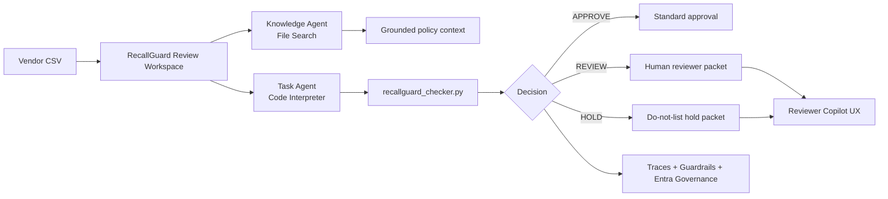

# RecallGuard AI

**A governed multi-agent product safety review workspace built for the Microsoft Agent-a-Thon Level 3: Master track.**

RecallGuard AI helps marketplace, procurement, and compliance teams review vendor product submissions before listing. It combines grounded Microsoft Foundry agents, deterministic evidence checks, human-in-the-loop review packets, and a polished local SaaS-style reviewer console.

<p align="left">
  <a href="https://www.microsoft.com/en-us/events/local-events/microsoft-agent-a-thon">
    
  </a>
  
  
  
  
</p>


## What It Does

RecallGuard AI reviews vendor CSV submissions and returns one auditable decision per product:

| Decision | Meaning | Reviewer action |
|---|---|---|
| `APPROVE` | Strong certification evidence and no strong recall signal | Proceed with standard approval |
| `REVIEW` | Missing identifiers, weak evidence, or insufficient confidence | Human reviewer checks the packet |
| `HOLD` | Strong recall match or safety risk signal | Do not list until resolved |

The system is deliberately not just a chatbot. It is a governed workflow where the agent experience is bounded by policy grounding, deterministic tools, traceable decision rules, and human review.

## Why This Project Matters

Unsafe or recalled products can enter marketplaces through incomplete vendor submissions, weak evidence, or misleading free-text notes. RecallGuard AI demonstrates how agentic systems can assist compliance teams without hiding the logic that matters most.

The product focuses on four principles:

- **Ground first**: policy and SOP answers come from a Foundry Knowledge Agent using File Search.
- **Act with tools**: product classification is performed by a Task Agent using Code Interpreter and a deterministic Python checker.
- **Stay auditable**: each result exposes `decision_rule`, evidence matches, missing fields, rationale, and recommended next action.
- **Keep humans in control**: `REVIEW` and `HOLD` outcomes generate human-review packets instead of pretending the system can approve everything.

## Microsoft Foundry Build

This project aligns with the Microsoft Agent-a-Thon Level 3 Master theme: Microsoft Foundry, multi-agent orchestration, and secure enterprise workflows.

| Layer | Implementation |
|---|---|
| Knowledge Agent | `recallguard-knowledge-agent` grounded over `knowledge-base/` policy files |
| Task Agent | `recallguard-task-agent-v7-public-data` with Code Interpreter |
| Workflow | Sequential routing: Knowledge Agent first, Task Agent when evidence action is required |
| Tools | File Search, Code Interpreter, deterministic CSV checker |
| Guardrails | Prompt-injection handling, safety thresholds, HITL escalation |
| Governance | Entra Agent ID notes, RBAC/least-privilege ownership model, trace runbooks |
| Evidence | Foundry setup outputs, test responses, build report, and final demo assets |

## Product Experience

The local reviewer console is designed as a real SaaS workflow, not a brochure page.

- **Review inbox**: four realistic case types, including recall risk and prompt-injection notes.
- **Evidence intake**: sample selector, CSV upload, editable CSV preview, and guided next action.
- **Run timeline**: intake, policy grounding, evidence scan, and packet routing.
- **Trace monitor**: Foundry workflow health, tool binding, guardrail, and RBAC indicators.
- **Decision output**: filters by `APPROVE`, `REVIEW`, and `HOLD`.
- **Reviewer packet**: evidence IDs, risk rationale, missing data, and next action.
- **Reviewer Copilot UX**: deterministic local assistant prototype for rationale, memo, and guardrail explanations.

## Architecture



## Repository Map

| Path | Purpose |
|---|---|
| `src/recallguard/` | Local API/server and deterministic checker package |
| `sample-data/` | Vendor CSV scenarios and recall/certification snapshot |
| `knowledge-base/` | Grounding sources for the Foundry Knowledge Agent |
| `workflows/` | Sequential workflow configuration artifacts |
| `docs/` | PRD, governance notes, audit/evaluation docs, setup evidence |
| `outputs/` | Foundry setup/test response evidence |
| `final/` | Submitted report, deck, videos, scripts, and packaged assets |
| `tests/` | Unit tests for decision behavior |

## Quick Start

```bash
python3 -m venv .venv
source .venv/bin/activate
pip install -e ".[dev]"
pytest
python scripts/run_local_server.py
```

Open:

```text
http://127.0.0.1:8765
```

Then choose a case from the review inbox and click `Run review`.

## Evaluation Harness

```bash
python scripts/evaluate_decision_harness.py
```

The harness evaluates 25 labeled vendor rows across approval, review, recall, missing data, and prompt-injection scenarios. Results are written to:

```text
outputs/evaluation/decision_harness_report.json
```

See `docs/Decision_Audit_and_Evaluation.md` for the decision table, recall-match thresholds, error categories, and human reviewer packet format.

## Public Recall Evidence Pipeline

```bash
python scripts/prepare_public_recall_dataset.py
```

This downloads and normalizes a Korea public recall dataset snapshot, then appends compact recall evidence into `sample-data/recall_certification_snapshot.csv` for Foundry Code Interpreter demos.

## Submission Assets

The final Microsoft Agent-a-Thon / Founderz-style submission package includes:

- Demo video under `final/`
- Build report PDF/DOCX under `final/`
- Foundry deck and scripts under `final/`
- Foundry validation notes under `docs/` and `outputs/`

The assignment submission format was video-first, with an optional support document. This repository keeps the implementation and evidence trail for portfolio review.

## Portfolio Review Path

For hiring managers, reviewers, or collaborators:

1. Run the local reviewer console.
2. Test `Safe products`, `Recall risk`, `Missing info`, and `Unsafe vendor note`.
3. Inspect a reviewer packet after running a case.
4. Read `docs/Decision_Audit_and_Evaluation.md`.
5. Read `docs/Foundry_Live_Validation_Summary.md`.
6. Check `tests/test_checker.py` for deterministic decision coverage.

## Tech Stack

<p align="left">
  
</p>

- Microsoft Foundry
- Azure AI Search / File Search grounding
- Code Interpreter-style task execution
- Python 3.11+
- Pytest
- Playwright verification
- Local browser reviewer console

## Status

RecallGuard AI is a completed Agent-a-Thon final activity build and a continuing portfolio project. Next improvements would include hosted deployment, authenticated reviewer sessions, persisted case history, and a production CopilotKit integration.
