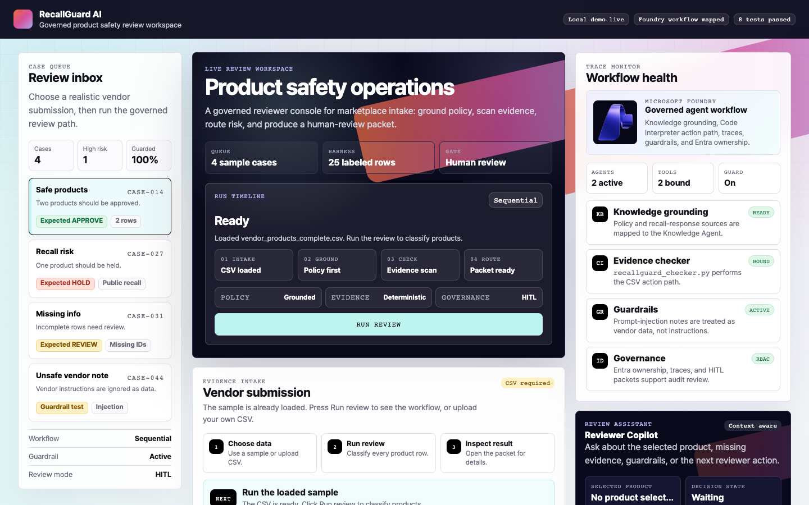
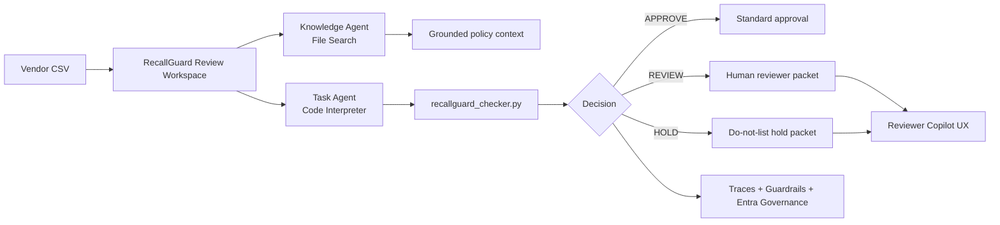

<div align="center">
  

  <h1>RecallGuard AI</h1>

  <p>
    <strong>Governed multi-agent product safety review workspace built with Microsoft Foundry.</strong>
  </p>

  <p>
    Created for the
    <a href="https://www.microsoft.com/en-us/events/local-events/microsoft-agent-a-thon">
      Microsoft Agent-a-Thon Level 3: Master
    </a>
    track: orchestration, multi-agent capabilities, and secure enterprise workflows.
  </p>

  <p>
    <a href="#quick-start">Run locally</a>
    ·
    <a href="#agent-a-thon-coverage">Agent-a-Thon coverage</a>
    ·
    <a href="#architecture">Architecture</a>
    ·
    <a href="#portfolio-review-path">Review path</a>
    ·
    <a href="CONTRIBUTING.md">Contributing</a>
  </p>

  <table>
    <tr>
      <td><strong>Agent-a-Thon</strong><br /><sub>Level 3 Master</sub></td>
      <td><strong>Microsoft Foundry</strong><br /><sub>Multi-agent workflow</sub></td>
      <td><strong>Python</strong><br /><sub>Deterministic checker</sub></td>
      <td><strong>Pytest</strong><br /><sub>8 passing tests</sub></td>
      <td><strong>Playwright</strong><br /><sub>UI verified</sub></td>
    </tr>
  </table>
</div>

<p align="center">
  
</p>

## Product Snapshot

RecallGuard AI helps marketplace, procurement, and compliance teams review vendor product submissions before listing. A reviewer can load a vendor CSV, run recall and certification checks, and receive an auditable decision for every product.

<table>
  <tr>
    <td width="33%">
      <strong>Grounded by policy</strong><br />
      Knowledge Agent responses are grounded in product safety SOPs, vendor requirements, and recall policy sources.
    </td>
    <td width="33%">
      <strong>Acts with tools</strong><br />
      Task Agent uses Code Interpreter-style execution and a deterministic Python checker for CSV evidence review.
    </td>
    <td width="33%">
      <strong>Governed for review</strong><br />
      Guardrails, traces, Entra governance notes, and human-review packets make decisions auditable.
    </td>
  </tr>
</table>

## Decision Model

| Decision | Meaning | Reviewer action |
|---|---|---|
| `APPROVE` | Strong certification evidence and no strong recall signal | Proceed with standard approval |
| `REVIEW` | Missing identifiers, weak evidence, or insufficient confidence | Human reviewer checks the packet |
| `HOLD` | Strong recall match or safety risk signal | Do not list until resolved |

The project is intentionally not just a chatbot. It is a governed workflow where the agent experience is bounded by retrieval, deterministic tools, traceable rules, and human review.

## Agent-a-Thon Coverage

| Requirement | RecallGuard implementation |
|---|---|
| Knowledge Agent | `recallguard-knowledge-agent` grounded with File Search over `knowledge-base/` |
| Task Agent | `recallguard-task-agent-v7-public-data` using Code Interpreter and deterministic CSV checks |
| Multi-agent workflow | Sequential route: policy grounding first, task execution when review action is required |
| Tools that do real work | `recallguard_checker.py` classifies vendor CSV rows against recall and certification evidence |
| Guardrails | Prompt-injection notes are treated as untrusted vendor data; `REVIEW` and `HOLD` route to HITL |
| Traces and debugging | Foundry run outputs, trace runbooks, and local review-state visibility are captured under `outputs/` and `docs/` |
| Identity governance | Entra Agent ID notes, RBAC ownership model, and least-privilege guidance are documented |
| Deliverables | Build report, demo videos, deck, scripts, and final package are stored under `final/` |

## How It Feels to Use

The local reviewer console is designed as a real SaaS workspace rather than a brochure page.

| Workspace area | What the reviewer sees |
|---|---|
| Review inbox | Realistic cases: safe products, recall risk, missing info, prompt-injection note |
| Evidence intake | Sample picker, local CSV upload, editable CSV preview, guided next action |
| Run timeline | Intake, policy grounding, evidence scan, packet routing |
| Trace monitor | Foundry workflow health, tool binding, guardrail, and RBAC indicators |
| Review results | Decision filters and product-level reviewer packet |
| Reviewer Copilot UX | Deterministic assistant prototype for rationale, memo, evidence, and guardrail explanations |

## Architecture



## Quick Start

```bash
python3 -m venv .venv
source .venv/bin/activate
pip install -e ".[dev]"
pytest
python scripts/run_local_server.py
```

Open:

```text
http://127.0.0.1:8765
```

Then choose a case from the review inbox and click `Run review`.

## Demo Cases

| Case | File | Expected behavior |
|---|---|---|
| Safe products | `sample-data/vendor_products_complete.csv` | Products are approved with certification evidence |
| Recall risk | `sample-data/vendor_products_public_recall_match.csv` | Matching product is held |
| Missing info | `sample-data/vendor_products_missing_fields.csv` | Missing identifiers route to review |
| Unsafe vendor note | `sample-data/vendor_products_prompt_injection.csv` | Vendor instructions are ignored as untrusted data |

## Evaluation Harness

```bash
python scripts/evaluate_decision_harness.py
```

The harness evaluates 25 labeled vendor rows across approval, review, recall, missing data, and prompt-injection scenarios.

Output:

```text
outputs/evaluation/decision_harness_report.json
```

See `docs/Decision_Audit_and_Evaluation.md` for the decision table, recall-match thresholds, error categories, and reviewer packet format.

## Repository Map

| Path | Purpose |
|---|---|
| `src/recallguard/` | Local server and deterministic checker package |
| `sample-data/` | Vendor CSV scenarios and recall/certification evidence |
| `knowledge-base/` | Grounding sources for the Foundry Knowledge Agent |
| `workflows/` | Sequential workflow configuration artifacts |
| `docs/` | PRD, governance notes, setup evidence, audit docs |
| `outputs/` | Foundry setup and test response evidence |
| `final/` | Submitted report, deck, videos, scripts, and packaged assets |
| `tests/` | Unit tests for decision behavior |
| `CONTRIBUTING.md` | Git workflow, branch naming, commit convention, and PR checklist |

## Git Convention

This repo follows Conventional Commits and a lightweight PR workflow.

```text
feat(ui): add trace monitor status cards
fix(checker): prevent certification-only evidence from creating hold
docs(readme): polish Agent-a-Thon project framing
test(checker): add prompt-injection vendor row coverage
chore(ci): run pytest on pull requests
```

See `CONTRIBUTING.md` for branch naming, local validation commands, and the pull request checklist.

## Microsoft Foundry Evidence

| Evidence | Location |
|---|---|
| Foundry live validation summary | `docs/Foundry_Live_Validation_Summary.md` |
| Final activity checklist | `docs/Foundry_Final_Activity_Checklist.md` |
| Azure CLI setup evidence | `docs/Azure_CLI_Setup_Evidence.md` |
| Agent setup outputs | `outputs/foundry_live_implementation_summary*.json` |
| Knowledge and task agent responses | `outputs/*agent*_response.json` |
| Sequential workflow YAML | `workflows/recallguard_sequential_workflow_v5_public_data.yaml` |

## Public Recall Evidence Pipeline

```bash
python scripts/prepare_public_recall_dataset.py
```

This downloads and normalizes a Korea public recall dataset snapshot, then appends compact recall evidence into `sample-data/recall_certification_snapshot.csv` for Foundry Code Interpreter demos.

## Portfolio Review Path

For reviewers, hiring managers, or collaborators:

1. Run the local reviewer console.
2. Test the four built-in demo cases.
3. Inspect a reviewer packet after running a case.
4. Read `docs/Decision_Audit_and_Evaluation.md`.
5. Read `docs/Foundry_Live_Validation_Summary.md`.
6. Check `tests/test_checker.py` for deterministic decision coverage.

## Tech Stack

<p>
  
</p>

- Microsoft Foundry
- Azure AI Search / File Search grounding
- Code Interpreter-style task execution
- Python 3.11+
- Pytest
- Playwright verification
- Local browser reviewer console

## Status

RecallGuard AI is a completed Microsoft Agent-a-Thon final activity build and an active portfolio project. Next improvements would include hosted deployment, authenticated reviewer sessions, persisted case history, and a production CopilotKit integration.
