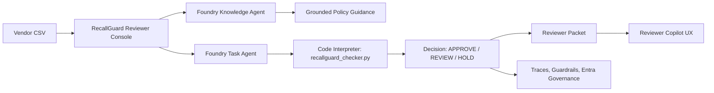

# RecallGuard AI

Governed multi-agent product safety compliance checker built with Microsoft Foundry.

<p align="left">
  
</p>

<p align="left">
  
  
  
  
  
  
</p>

## What This Project Is

RecallGuard AI is a product safety review console for marketplace, procurement, and compliance teams. A reviewer can load or upload a vendor CSV, run recall and certification checks, and receive a clear decision for each product:

- `APPROVE`: evidence is strong enough to proceed
- `REVIEW`: missing or weak evidence needs a human check
- `HOLD`: recall risk or strong safety signal, do not list

The project is intentionally not just a chatbot. It is a governed agent workflow with a real task surface, deterministic evidence checks, reviewer packets, guardrails, traces, and identity governance.

## Why It Matters

Unsafe or recalled products can enter marketplaces through incomplete vendor submissions. RecallGuard AI shows how agents can support that workflow without hiding the decision logic behind vague language.

The system combines:

- grounded policy answers from a Microsoft Foundry Knowledge Agent
- concrete CSV review through a Microsoft Foundry Task Agent with Code Interpreter
- deterministic Python decision rules for auditability
- human-in-the-loop escalation for `REVIEW` and `HOLD`
- a local reviewer console that makes the workflow easy to test
- a Reviewer Copilot UX layer for explaining decisions and drafting review memos

## Skills Demonstrated

| Area | Evidence in this repo |
|---|---|
| Multi-agent architecture | Knowledge Agent, Task Agent, and Sequential Workflow design |
| Tool-using agents | Code Interpreter checker for CSV classification |
| Grounded knowledge | `knowledge-base/` policy files and File Search setup |
| Governance | guardrails, trace runbooks, Entra Agent ID notes, HITL packets |
| Evaluation | 25-row labeled decision harness with per-label metrics |
| Product UX | local reviewer console with guided next actions and decision filters |
| Data pipeline | public KATS recall data download and normalization |
| Testing | pytest unit tests plus Playwright UI verification |

## User Flow

1. Choose a sample case or upload a vendor CSV.
2. Click `Run review`.
3. Filter results by `APPROVE`, `REVIEW`, or `HOLD`.
4. Open a reviewer packet to see evidence, missing fields, rationale, and next action.
5. Ask the Reviewer Copilot for decision rationale, evidence checks, guardrail explanation, or a reviewer memo.

## Architecture



## Implemented Components

- **Knowledge Agent**: `recallguard-knowledge-agent` grounded with File Search over `knowledge-base/`.
- **Task Agent**: `recallguard-task-agent-v7-public-data` using Code Interpreter plus deterministic CSV evidence checks.
- **Sequential Workflow**: Knowledge Agent first, then Task Agent for evidence-check review requests, with a HITL note for `HOLD`.
- **Local Reviewer Console**: browser-based CSV checker for samples, uploads, decision filters, reviewer packets, and copilot-style explanations.
- **Audit Layer**: product-level `decision_rule` and `reviewer_packet` outputs, plus a 25-row labeled evaluation harness.
- **Governance Evidence**: Microsoft DefaultV2 RAI policy evidence, guardrail notes, trace runbook, Entra Agent IDs, CLI setup evidence, and final build report.
- **Public Dataset Pipeline**: downloads and normalizes Korea Data Portal/KATS domestic recall CSV evidence into the Foundry demo snapshot.
- **Submission Assets**: PDF/DOCX report, MP4 demo, editable PPT deck, narration scripts, and packaged zip under `final/`.

## Current Azure Setup

- Subscription: Azure for Students
- Resource group: `rg-recallguard-foundry-je`
- Region: `japaneast`
- Foundry resource: `recallguard-somi-20260513`
- Foundry project: `recallguard-ai`
- Model deployment: `gpt-4o-mini`
- Demo model deployment: `gpt-4o-mini-100`
- Model SKU: `GlobalStandard`

## Submission-Focused Build Path

1. Use the files in `knowledge-base/` as the grounded knowledge source.
2. Use the files in `sample-data/` as Task Agent demo inputs.
3. Create two Foundry agents:
   - `RecallGuard Knowledge Agent`
   - `RecallGuard Task Agent public-data`
4. Create a Sequential workflow:
   - Knowledge Agent first
   - Task Agent second for evidence-check review requests
   - Human-in-the-loop note for `HOLD`
5. Capture Preview, Traces, Guardrails, and Entra Agent ID evidence.

See `docs/RecallGuard_AI_PRD.md` and `docs/Foundry_Final_Activity_Checklist.md`.

## Run Local Tests

```bash
python3 -m venv .venv
source .venv/bin/activate
pip install -e ".[dev]"
pytest
```

## Run Decision Evaluation Harness

```bash
python scripts/evaluate_decision_harness.py
```

This evaluates 25 labeled vendor rows across `APPROVE`, `REVIEW`, and `HOLD`, then writes per-label precision/recall and mismatch details to `outputs/evaluation/decision_harness_report.json`. See `docs/Decision_Audit_and_Evaluation.md` for the decision table, recall-match thresholds, and human reviewer packet format.

## Run Local Browser Demo

```bash
python scripts/run_local_server.py
```

Then open `http://127.0.0.1:8765`. The local UI lets you run sample vendor CSVs, paste your own CSV rows, inspect `decision_rule` and `reviewer_packet` outputs, and load the 25-row evaluation metrics. See `docs/Local_Demo_Server.md`.

The right-side Reviewer Copilot is a deterministic local UX prototype for the CopilotKit layer. It keeps Foundry as the governed backend while showing how a future in-app assistant would explain decisions, draft reviewer memos, and guide human review. See `docs/CopilotKit_V2_Integration.md`.

## Suggested Portfolio Review Path

For reviewers, hiring managers, or collaborators:

1. Read this README for the product framing and architecture.
2. Run the local browser demo and test the four built-in scenarios.
3. Inspect `docs/Decision_Audit_and_Evaluation.md` for the decision table, thresholds, and evaluation harness.
4. Inspect `docs/Portfolio_Product_Strategy.md` for the career-facing product narrative and roadmap.
5. Inspect `docs/CopilotKit_V2_Integration.md` for the product UX roadmap.
6. Inspect `docs/Azure_CLI_Setup_Evidence.md` and `docs/Foundry_Live_Validation_Summary.md` for Microsoft Foundry implementation evidence.
7. Run `pytest` to validate the deterministic checker.

## Regenerate Public Recall Evidence

```bash
python scripts/prepare_public_recall_dataset.py
```

This downloads the KATS domestic product safety recall dataset from the Korea Data Portal, writes the original CSV to `data/raw/`, normalizes it under `data/processed/`, and appends a compact KATS recall snapshot to `sample-data/recall_certification_snapshot.csv` for Foundry Code Interpreter demos.

## Regenerate Artifacts

```bash
python scripts/build_submission_package.py
python scripts/build_ppt_video.py
node scripts/record_playwright_demo.cjs
```

The Foundry provisioning script is `scripts/setup_foundry_agents.sh`. It expects Azure CLI login and reads the AI Services key at runtime; no API keys are stored in this repository.
